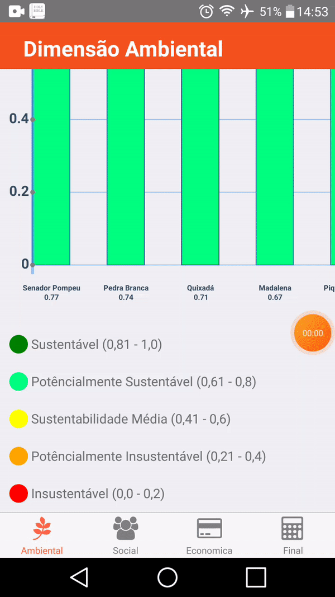

<h1 align=center> <b>Sisbhi</b></h1>
<h1 align=center>

</h1>

<h1 align=center>

</h1>
<h1 align=center>

</h1>
<h1 align=center>

</h1>


## 📖 Sobre
O projeto **Sisbhi** é um app que calcula de forma automática o índice de sustentabilidade das cidades que compõem as bacias hidrográficas do Ceará, usando indicadores ambientais, sociais e econômicos obtidos no IBGE e IPECE. Sendo desenvolvido no Programa Institucional de Bolsas de Iniciação em Desenvolvimento
Tecnológico e Inovação – PIBITI - IFCE/CNPq.

---

## 🚀 Tecnologias
- [React-Native](https://reactnative.dev/)
- [React-Navigation](https://reactnavigation.org/)
- [Redux](https://redux.js.org/)
- [Redux-thunk](https://github.com/reduxjs/redux-thunk)
- [Axios](https://github.com/axios/axios)
- [Firebase](https://rnfirebase.io/)
- [Lodash](https://lodash.com/)
- [React-native-vector-icons](https://github.com/oblador/react-native-vector-icons)
- [React-native-pathjs-charts](https://github.com/capitalone/react-native-pathjs-charts)
---
## Como baixar o projeto
```bash
# Clonar o repositório
$ git clone https://github.com/marcelo-melooliveira/Sisbhi Sisbhi

# Entrar na pasta do repositório
$ cd Sisbhi

# Instalar as dependências
$ npm install

# Rodar o app no Android
$ react-native run-android

```

---
Desenvolvido de ❤ por Marcelo Melo
